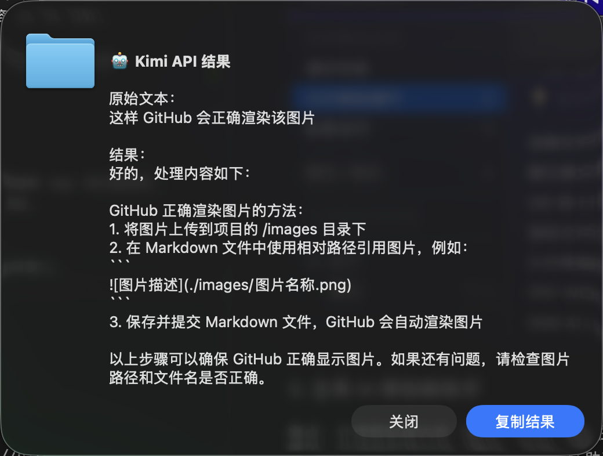

# CommondX

**补全 Finder 缺失的拼图，让 Mac 用起来更像 Mac。**

---

## 为什么做这个工具？

macOS Finder 在某些操作上不够高效。作为日常使用 Mac 的开发者，我做了 CommondX 来解决这些问题。

### 1. 把 `Cmd+X` 还给 macOS

Finder 不支持文件剪切，移动文件需要复制+粘贴+删除，或者拖拽。

**解决方案**：实现 `Cmd+X` 剪切和 `Cmd+V` 移动，操作方式与 Windows 一致。

* 选中文件 `Cmd+X` 剪切
* 目标位置 `Cmd+V` 移动
* 支持多文件批量操作、跨磁盘移动


### 2. 快速操作菜单

压缩、解压、格式转换等操作需要打开特定应用，步骤繁琐。

**解决方案**：连续两次选择相同文件时，显示操作菜单。

* 基础操作：压缩/解压、复制路径、终端打开
* 格式转换：Markdown 转 HTML、PDF/Word 在线编辑
* AI 处理：配置 API 后，直接对文件内容进行 AI 分析


### 3. 全局 AI 剪贴板助手

处理剪贴板内容（翻译、总结）需要在浏览器和 App 间反复跳转。

**解决方案**：连续两次 `Cmd+C` 复制相同内容时，自动触发 AI 处理。

* 支持文本、图片、文件内容
* 可进行翻译、解释、总结、分析
* 无需离开当前窗口



---

## 安装使用

### 快速开始

1. 下载 [CommondX-1.0.0.dmg](https://github.com/zhangs-cedar/mac-commondX/releases/download/1.0.0/CommondX-1.0.0.dmg)
2. 拖入 Applications 文件夹
3. 首次运行授予辅助功能权限

### 许可证

| 方案 | 价格 | 说明 |
| --- | --- | --- |
| 免费试用 | ¥0 | 21 天全功能免费体验 |
| 正式激活 | ¥2.00 / 年 | 支持持续开发 |
| 开源协议 | CC BY-NC 4.0 | 代码完全开源，供学习研究（非商用） |

👉 [获取激活码](https://wj.qq.com/s2/25468218/6ee1/)

---

## 开发说明

这个项目使用 [Cursor](https://cursor.sh/) 开发，是一次 AI 辅助编程的实践。

### 开发方式

通过三个文件控制 AI 开发行为：

1. **`.cursorrules`**：定义代码风格和架构原则，AI 自动遵循
2. **`流程图.md`**：描述业务逻辑和架构设计，确保代码修改与整体一致
3. **`.ai-errors-log.md`**：记录历史错误和解决方案，避免重复犯错

修改代码时，AI 会读取这些文件，生成符合规范的代码。

### 项目结构

```
mac-commondX/
├── .cursorrules          # 开发规范
├── .ai-errors-log.md     # 错误模式库
├── 流程图.md             # 业务逻辑和架构设计
├── src/
│   ├── app.py           # 应用主逻辑
│   ├── event_tap.py     # 全局快捷键监听
│   ├── cut_manager.py   # 文件剪切管理
│   ├── status_bar.py    # 状态栏菜单
│   └── plugins/         # 插件系统
└── main.py              # 应用入口
```

如果你对 AI 辅助开发感兴趣，欢迎查看代码：

👉 [GitHub: zhangs-cedar/mac-commondX](https://github.com/zhangs-cedar/mac-commondX)

---

## 反馈

* **Issues**：[GitHub 提交反馈](https://github.com/zhangs-cedar/mac-commondX/issues)
* **微信**：`z858998813`（备注 CommondX）

---
