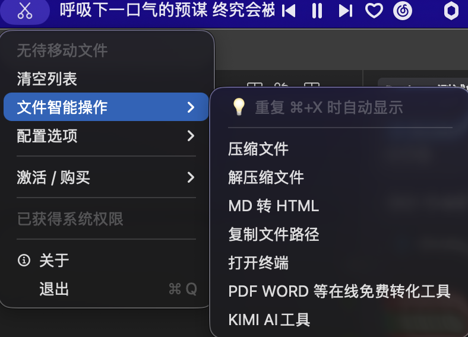

# CommondX

> [!summary]
> 为 macOS Finder 补上原生缺失的「文件剪切」体验：`Cmd+X` 剪切，`Cmd+V` 移动。  
> 设计灵感来自 [Mac AppStore Command X](https://apps.apple.com/us/app/command-x/id6448461551?mt=12)。

## 快速导航

- [产品定位](#产品定位)
- [目标用户](#目标用户)
- [核心能力](#核心能力)
- [使用流程](#使用流程)
- [安装与使用](#安装与使用)
- [边界与说明](#边界与说明)
- [开发者入口](#开发者入口)
- [反馈](#反馈)

## 产品定位

CommondX 是一个面向 Finder 高频操作的效率增强工具，核心目标是：

- 降低「文件移动」的操作成本
- 缩短「常用文件操作」的路径长度
- 用接近原生的交互方式保持学习成本最低

## 目标用户

- 日常需要频繁整理文件的 macOS 用户
- 习惯 Windows `Ctrl+X / Ctrl+V` 文件操作逻辑的迁移用户
- 希望在 Finder 内完成压缩、路径复制、格式转换等操作的用户

## 核心能力

### 1) Finder 文件剪切移动

- 选中文件后 `Cmd+X` 进入待移动状态
- 在目标目录 `Cmd+V` 执行移动
- 支持多文件批量与跨目录移动


### 2) 智能操作菜单（重复选择触发）

当连续两次对同一批文件执行触发操作时，弹出快捷菜单，提供：

- 压缩 / 解压
- 复制文件路径
- 打开终端（切换到目标目录）
- Markdown 转 HTML
- PDF/Word 在线工具入口



## 使用流程

1. 在 Finder 选中文件并按 `Cmd+X`
2. 如果重复选择同一批文件，显示智能操作菜单
3. 选择目标操作，或切换目录后按 `Cmd+V` 完成移动

## 安装与使用

### 快速开始

1. 下载 [CommondX-2.0.0.dmg](https://github.com/zhangs-cedar/mac-commondX/releases/download/2.0.0/CommondX-2.0.0.dmg)
2. 拖入 `Applications`
3. 首次启动后授予辅助功能权限（Accessibility）

## 边界与说明

源码协议为 [CC BY-NC 4.0](https://creativecommons.org/licenses/by-nc/4.0/)（非商业使用与再分发请遵守协议条款）。

## 开发者入口

### 协作方式

项目采用「规则 + 流程图 + Skill」协作：

1. `/.cursorrules`：编码规范与行为约束
2. `/流程图.md`：业务链路与状态流
3. `/.cursor/skills/commondx-errors/`：错误模式 Skill（`SKILL.md` + `reference.md`）

### 代码结构

```text
mac-commondX/
├── .cursorrules
├── .cursor/skills/commondx-errors/
├── 流程图.md
├── src/
│   ├── app.py
│   ├── event_tap.py
│   ├── cut_manager.py
│   ├── status_bar.py
│   └── plugins/
└── main.py
```

仓库地址：  
[GitHub: zhangs-cedar/mac-commondX](https://github.com/zhangs-cedar/mac-commondX)

## 反馈

- Issues: [GitHub 提交反馈](https://github.com/zhangs-cedar/mac-commondX/issues)
- 微信：`z858998813`（备注 CommondX）

