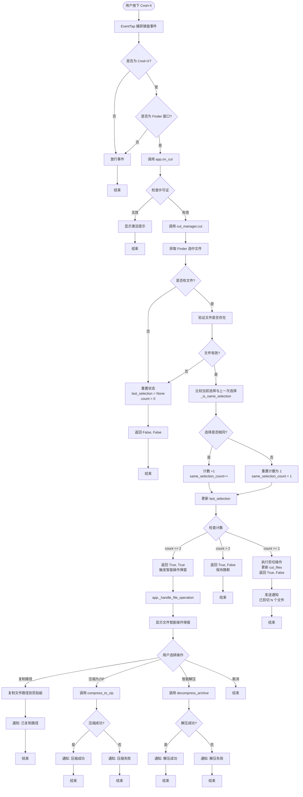
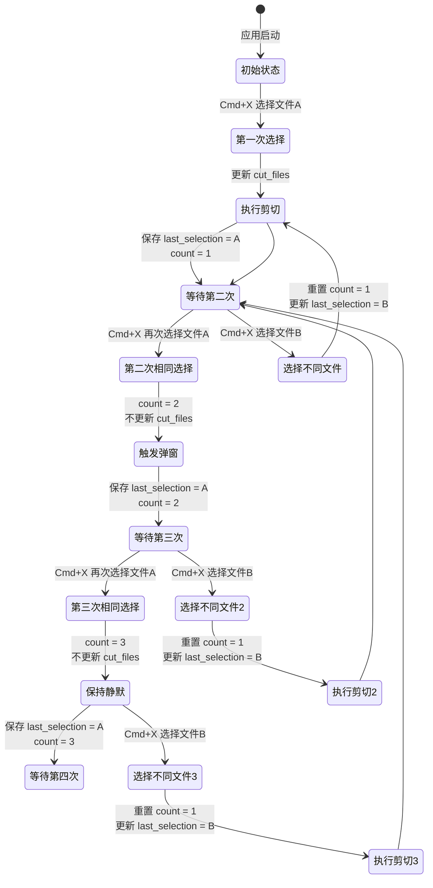

# CommondX 处理流程图

## Cmd+X 快捷键处理流程

## 状态跟踪逻辑

## 核心设计逻辑

### 1. 选择比较机制
- 使用 `set()` 比较文件列表，忽略顺序
- 比较的是文件路径的集合

### 2. 状态计数规则
- **第一次选择**：`count = 1`，执行剪切，更新 `cut_files`
- **第二次相同选择**：`count = 2`，触发智能操作弹窗，**不更新** `cut_files`
- **第三次及以后相同选择**：`count >= 3`，保持静默，**不更新** `cut_files`
- **选择不同文件**：重置 `count = 1`，重新开始计数

### 3. 智能操作弹窗
- 仅在 `count == 2` 时触发
- 显示文件列表和可用操作
- 根据文件类型智能显示按钮：
  - 全部是压缩文件 → 显示"智能解压"
  - 有普通文件/文件夹 → 显示"压缩为 ZIP"
  - 始终显示"复制路径"

### 4. 操作处理
- **复制路径**：将文件路径列表复制到剪贴板
- **压缩为 ZIP**：调用 `compress_to_zip()` 压缩文件
- **智能解压**：调用 `decompress_archive()` 解压压缩文件

## 关键代码位置

- **事件捕获**: `src/event_tap.py` - `EventTap._callback()`
- **主逻辑**: `src/app.py` - `CommondXApp.on_cut()`
- **选择管理**: `src/cut_manager.py` - `CutManager.cut()`
- **弹窗显示**: `src/file_dialog.py` - `show_file_operations_dialog()`
- **操作处理**: `src/app.py` - `CommondXApp._handle_file_operation()`
