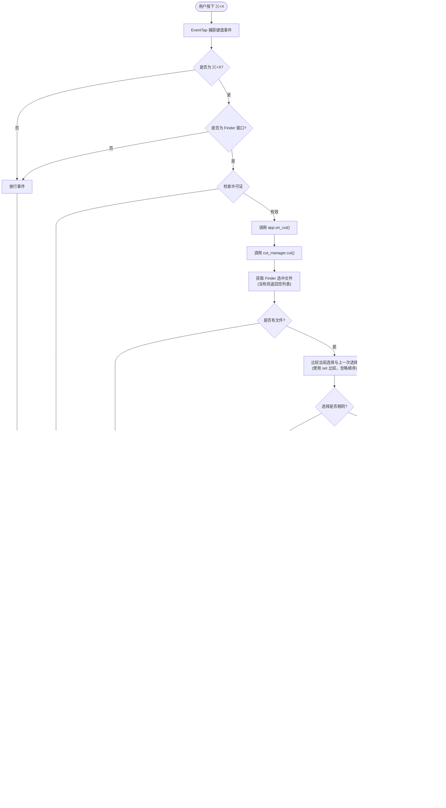

# CommondX 处理流程图

## ⌘+X 快捷键处理流程



## 核心设计逻辑

### 1. 选择比较机制
- 使用 `set()` 比较文件列表，忽略顺序
- 空列表 `[]` 和 `None` 被视为相同（都是空选择）
- 比较结果决定是执行剪切还是显示智能操作菜单

### 2. 处理规则
- **选择与上次不同**：执行剪切，更新 `cut_files` 和 `last_selection`
- **选择与上次相同**：触发智能操作菜单，更新 `last_selection`
- **没有文件**：返回 `(False, False)`，更新 `last_selection = []`

### 3. 状态管理
- **last_selection 更新时机**：
  - 有文件且选择不同 → 执行剪切后更新为当前选择
  - 有文件且选择相同 → 比较后更新为当前选择
  - 没有文件 → 更新为空列表 `[]`
- **last_selection 重置时机**：
  - 用户选择"取消" → 重置为 `None`（保持状态以便重试）
  - 用户完成操作（复制/压缩/解压）→ 重置为 `None`

### 4. 智能操作菜单
- **触发条件**：选择与上次相同时触发
- **菜单显示**：在状态栏图标位置显示菜单，支持键盘导航（上下键选择，回车确认，ESC 取消）
- **操作选项**：
  - **复制路径**：将文件路径列表复制到剪贴板
  - **压缩为 ZIP**：调用 `compress_to_zip()` 压缩文件
  - **智能解压**：调用 `decompress_archive()` 解压压缩文件
  - **MD 转 HTML**：调用 `convert_md_to_html()` 转换 Markdown 文件
  - **MD 转 PDF**：调用 `convert_md_to_pdf()` 转换 Markdown 文件
  - **取消**：不执行任何操作，保持 `last_selection` 不变（允许下次继续显示菜单）

### 5. 操作处理流程
- **复制路径**：直接复制，通知成功
- **压缩/解压**：执行操作，根据结果通知成功或失败
- **所有操作完成后**：重置 `last_selection = None`

## 状态栏菜单结构

### 完整菜单配置示例

```
状态栏图标菜单
  ├── 许可信息
  │   ├── 试用期 (剩余 N 天) / ⚠ 试用期已结束 / ✓ 已激活
  │   └── 激活 / 购买...
  ├── ────────────────
  ├── 功能区
  │   ├── 无待移动文件 / 待移动 N 个文件
  │   ├── 清空列表
  │   └── 文件智能操作
  │       ├── 💡 重复 ⌘+X 时自动显示
  │       ├── ────────────────
  │       ├── 操作选项（根据配置显示）
  │       │   ├── 压缩文件
  │       │   ├── 解压缩文件
  │       │   ├── MD 转 HTML
  │       │   ├── MD 转 PDF
  │       │   └── 复制文件路径
  │       ├── ────────────────
  │       └── 配置选项
  │           ├── ⚙️ 配置显示项 (标题，禁用)
  │           ├── ☑ 压缩文件 (复选框，可点击)
  │           ├── ☑ 解压缩文件 (复选框，可点击)
  │           ├── ☑ MD 转 HTML (复选框，可点击)
  │           ├── ☑ MD 转 PDF (复选框，可点击)
  │           └── ☑ 复制文件路径 (复选框，可点击)
  ├── ────────────────
  ├── 系统设置
  │   ├── 已获得系统权限 / 未获得系统权限 (点击授权)
  │   └── 开机自启 (复选框)
  ├── ────────────────
  ├── 关于
  └── 退出 (⌘Q)
```

### 菜单说明

- **许可信息**：显示许可证状态，支持激活和购买
- **功能区**：显示待移动文件状态，支持清空列表和智能操作
- **文件智能操作**：
  - 重复 ⌘+X 选择相同文件时自动显示
  - 支持键盘导航（上下键选择，回车确认，ESC 取消）
  - 可配置显示的操作选项（通过复选框）
- **系统设置**：权限管理和开机自启配置

## 关键代码位置

- **事件捕获**: `src/event_tap.py` - `EventTap._callback()`
- **主逻辑**: `src/app.py` - `CommondXApp.on_cut()`
- **选择管理**: `src/cut_manager.py` - `CutManager.cut()`
- **菜单显示**: `src/status_bar.py` - `show_smart_operations_menu()`（使用状态栏菜单，支持键盘导航）
- **菜单配置**: `src/status_bar.py` - `_build_smart_ops_menu()`（根据配置动态构建菜单）
- **操作处理**: `src/status_bar.py` - 各 `smart*_()` 方法（处理具体的智能操作）
