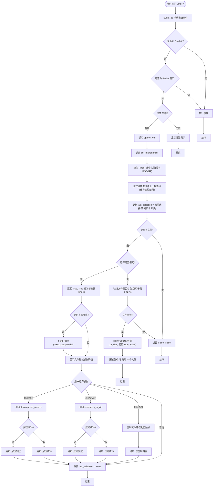

# CommondX 处理流程图

## Cmd+X 快捷键处理流程

## 状态跟踪逻辑

## 核心设计逻辑

### 1. 选择比较机制
- 使用 `set()` 比较文件列表，忽略顺序
- 只比较当前选择和上一次选择

### 2. 处理规则
- **选择与上次不同**：执行剪切
- **选择与上次相同**：触发智能操作弹窗

### 3. 智能操作弹窗
- 当选择与上次相同时触发
- 如果已有弹窗显示，先关闭旧弹窗再显示新弹窗
- 显示文件列表和可用操作
- 根据文件类型智能显示按钮：
  - 全部是压缩文件 → 显示"智能解压"
  - 有普通文件/文件夹 → 显示"压缩为 ZIP"
  - 始终显示"复制路径"

### 4. 操作处理
- **复制路径**：将文件路径列表复制到剪贴板
- **压缩为 ZIP**：调用 `compress_to_zip()` 压缩文件
- **智能解压**：调用 `decompress_archive()` 解压压缩文件
- **取消**：不执行任何操作
- **所有操作完成后**：重置 `last_selection = None`

## 关键代码位置

- **事件捕获**: `src/event_tap.py` - `EventTap._callback()`
- **主逻辑**: `src/app.py` - `CommondXApp.on_cut()`
- **选择管理**: `src/cut_manager.py` - `CutManager.cut()`
- **弹窗显示**: `src/file_dialog.py` - `show_file_operations_dialog()`
- **操作处理**: `src/app.py` - `CommondXApp._handle_file_operation()`
