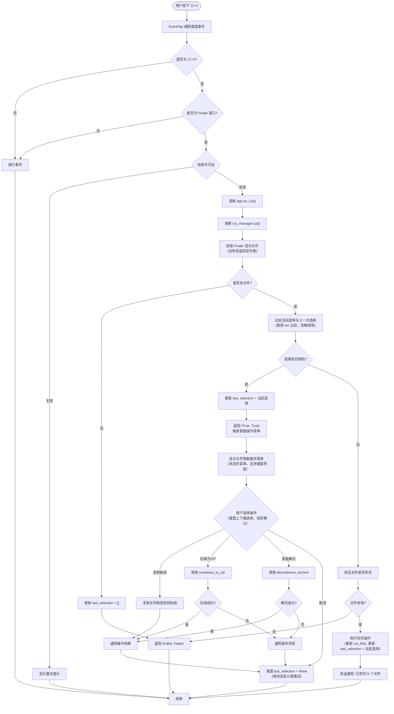

# CommondX 处理流程图

## ⌘+X 快捷键处理流程



## 核心设计逻辑

### 1. 选择比较机制
- 使用 `set()` 比较文件列表，忽略顺序
- 空列表 `[]` 和 `None` 被视为相同（都是空选择）
- 比较结果决定是执行剪切还是显示智能操作菜单

### 2. 处理规则
- **选择与上次不同**：执行剪切，更新 `cut_files` 和 `last_selection`
- **选择与上次相同**：触发智能操作菜单，更新 `last_selection`
- **没有文件**：返回 `(False, False)`，更新 `last_selection = []`

### 3. 状态管理
- **last_selection 更新时机**：
  - 有文件且选择不同 → 执行剪切后更新为当前选择
  - 有文件且选择相同 → 比较后更新为当前选择
  - 没有文件 → 更新为空列表 `[]`
- **last_selection 重置时机**：
  - 用户选择"取消" → 重置为 `None`（保持状态以便重试）
  - 用户完成操作（复制/压缩/解压）→ 重置为 `None`

### 4. 智能操作菜单
- **触发条件**：选择与上次相同时触发
- **菜单显示**：在状态栏图标位置显示菜单，支持键盘导航（上下键选择，回车确认，ESC 取消）
- **操作选项**：
  - **复制路径**：将文件路径列表复制到剪贴板
  - **压缩为 ZIP**：调用 `compress_to_zip()` 压缩文件
  - **智能解压**：调用 `decompress_archive()` 解压压缩文件
  - **MD 转 HTML**：调用 `convert_md_to_html()` 转换 Markdown 文件
  - **MD 转 PDF**：调用 `convert_md_to_pdf()` 转换 Markdown 文件
  - **取消**：不执行任何操作，保持 `last_selection` 不变（允许下次继续显示菜单）

### 5. 操作处理流程
- **复制路径**：直接复制，通知成功
- **压缩/解压**：执行操作，根据结果通知成功或失败
- **所有操作完成后**：重置 `last_selection = None`

## 状态栏菜单结构

### 完整菜单配置示例

```
状态栏图标菜单
  ├── 许可信息
  │   ├── 试用期 (剩余 N 天) / ⚠ 试用期已结束
  │   └── 激活 / 购买...（激活码激活延长1年）
  ├── ────────────────
  ├── 功能区
  │   ├── 无待移动文件 / 待移动 N 个文件
  │   ├── 清空列表
  │   ├── 文件智能操作
  │   │   ├── 💡 重复 ⌘+X 时自动显示 
  │   │   ├── ────────────────
  │   │   └── 操作选项（根据配置显示）
  │   │       ├── 压缩文件
  │   │       ├── 解压缩文件
  │   │       ├── MD 转 HTML
  │   │       ├── MD 转 PDF
  │   │       └── 复制文件路径
  │   └── 配置选项
  │       ├── ⚙️ 配置显示项 (标题，禁用)
  │       ├── ☑ 压缩文件 (子菜单，点击不关闭主菜单)
  │       │   ├── 启用/禁用 (复选框，可点击)
  │       │   └── ↓ 下移 (可点击，调整顺序)
  │       ├── ☑ 解压缩文件 (子菜单，点击不关闭主菜单)
  │       │   ├── 启用/禁用 (复选框，可点击)
  │       │   ├── ↑ 上移 (可点击，调整顺序)
  │       │   └── ↓ 下移 (可点击，调整顺序)
  │       ├── ☑ MD 转 HTML (子菜单，点击不关闭主菜单)
  │       │   ├── 启用/禁用 (复选框，可点击)
  │       │   ├── ↑ 上移 (可点击，调整顺序)
  │       │   └── ↓ 下移 (可点击，调整顺序)
  │       ├── ☑ MD 转 PDF (子菜单，点击不关闭主菜单)
  │       │   ├── 启用/禁用 (复选框，可点击)
  │       │   ├── ↑ 上移 (可点击，调整顺序)
  │       │   └── ↓ 下移 (可点击，调整顺序)
  │       └── ☑ 复制文件路径 (子菜单，点击不关闭主菜单)
  │           ├── 启用/禁用 (复选框，可点击)
  │           └── ↑ 上移 (可点击，调整顺序)
  │       ├── ────────────────
  │       └── 📝 编辑配置文件 (打开配置文件进行编辑)
  ├── ────────────────
  ├── 系统设置
  │   ├── 已获得系统权限 / 未获得系统权限 (点击授权)
  │   └── 开机自启 (复选框)
  ├── ────────────────
  ├── 关于
  │   ├── 显示应用信息和许可证状态
  │   ├── 访问官网（打开 GitHub 链接）
  │   └── 延长试用期（7天）（如果未激活且距离上次延长≥7天）
  ├── 延长试用期（7天）（如果未激活且可延长时显示）
  └── 退出 (⌘Q)
```

### 菜单说明

- **许可信息**：显示许可证状态，支持激活和购买
  - 激活码激活时延长试用期1年（365天），不是永久激活
  - 可以多次激活，每次激活都会延长1年
  - 显示剩余天数，不再显示"已激活"状态
- **功能区**：显示待移动文件状态，支持清空列表和智能操作
- **文件智能操作**：
  - 重复 ⌘+X 选择相同文件时自动显示
  - 支持键盘导航（上下键选择，回车确认，ESC 取消）
  - 可配置显示的操作选项（通过复选框）
  - 操作选项的显示顺序与配置选项的顺序一致
- **配置选项**：
  - 每个配置项使用子菜单结构，点击配置项时展开子菜单，主菜单保持打开（不关闭）
  - 子菜单中包含"启用/禁用"选项（复选框）和"上移/下移"选项（调整顺序）
  - 第一个配置项的子菜单只显示"↓ 下移"，最后一个配置项的子菜单只显示"↑ 上移"
  - 主菜单项标题显示复选框状态（☑ 启用 / ☐ 禁用）
  - 顺序调整后自动保存，并在"文件智能操作"菜单中同步显示
  - 优化体验：点击配置项展开子菜单，主菜单不关闭，方便连续操作多个配置项
  - **编辑配置文件**：高级选项，点击后使用系统默认编辑器打开配置文件，方便直接编辑配置（有利于后续智能化扩展）
- **系统设置**：权限管理和开机自启配置
- **关于**：
  - 显示应用信息、版本、作者联系方式
  - 显示许可证状态（试用期剩余/试用期已结束）
  - 如果已使用激活码，显示"已使用激活码延长"提示
  - **访问官网**：打开 GitHub 项目链接
  - **延长试用期（7天）**：如果距离上次延长≥7天，可以延长试用期7天
    - 每7天可以延长一次，延长7天
    - 延长后刷新菜单，更新许可证状态显示
- **延长试用期（7天）**：在菜单中直接显示（如果可延长时）

## 关键代码位置

- **事件捕获**: `src/event_tap.py` - `EventTap._callback()`
- **主逻辑**: `src/app.py` - `CommondXApp.on_cut()`
- **选择管理**: `src/cut_manager.py` - `CutManager.cut()`
- **菜单显示**: `src/status_bar.py` - `show_smart_operations_menu()`（使用状态栏菜单，支持键盘导航）
- **菜单配置**: `src/status_bar.py` - `_build_smart_ops_menu()`（根据配置动态构建菜单）
- **操作处理**: `src/status_bar.py` - 各 `smart*_()` 方法（处理具体的智能操作）
- **许可证管理**: `src/license_manager.py` - `LicenseManager`（试用期管理、激活验证、延长试用期）
  - `activate()`: 激活码激活时延长试用期1年（365天），可多次激活
  - `extend_trial()`: 每7天可延长7天试用期
  - `get_status()`: 返回试用期状态（trial/expired）和剩余天数
- **关于菜单**: `src/status_bar.py` - `showAbout_()`（显示应用信息、访问官网、延长试用期）