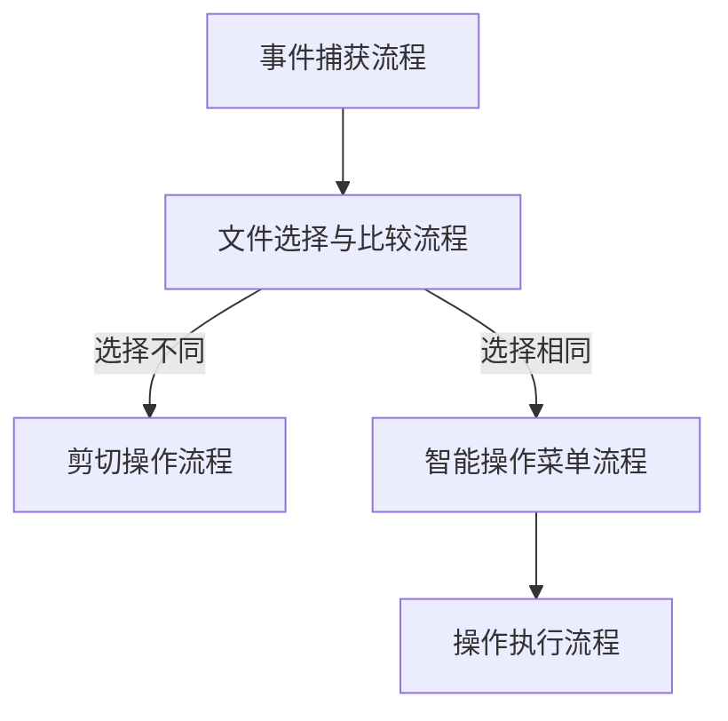
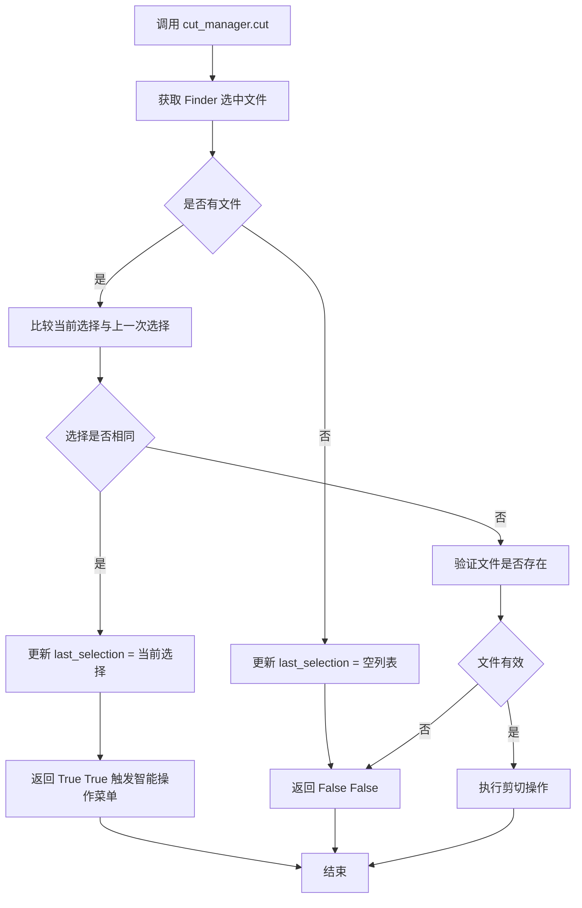
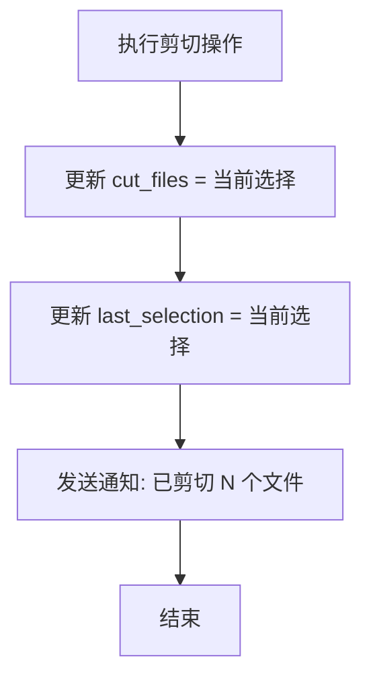
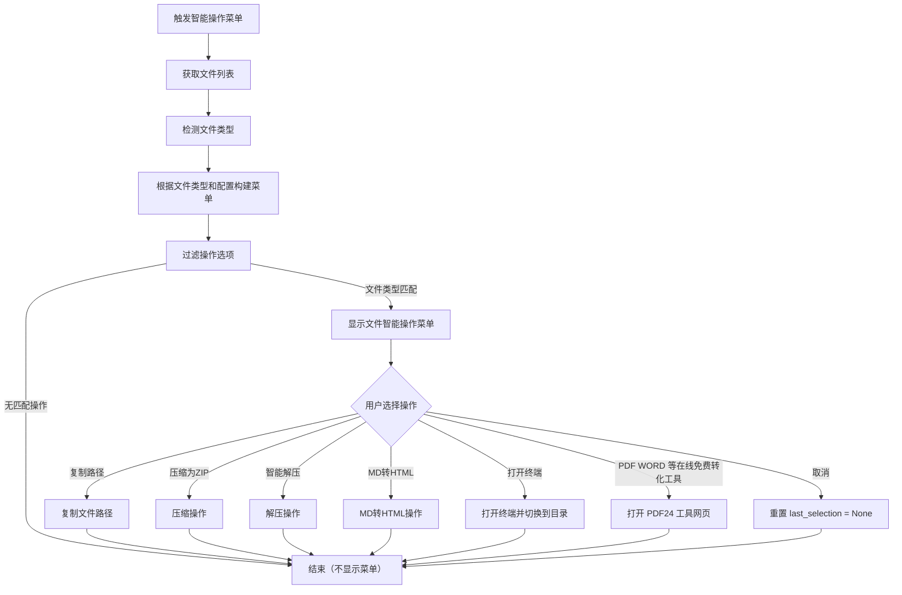

# CommondX 处理流程图

## 流程图模块

### 模块关系图


```mermaid
flowchart TD
    EventCapture["事件捕获流程"] --> FileSelection["文件选择与比较流程"]
    FileSelection -->|"选择不同"| CutOperation["剪切操作流程"]
    FileSelection -->|"选择相同"| SmartMenu["智能操作菜单流程"]
    SmartMenu --> OperationExec["操作执行流程"]
```

**模块说明**：
- **事件捕获流程**：系统级事件处理，验证快捷键与前台是否为 Finder
- **文件选择与比较流程**：业务逻辑核心，决定执行路径
- **剪切操作流程**：执行文件剪切，更新状态
- **智能操作菜单流程**：用户交互界面，显示操作选项
- **操作执行流程**：执行具体文件操作，处理结果

### 1. 事件捕获流程

**职责**：捕获和处理键盘事件，验证快捷键与 Finder 前台

**输入**：系统键盘事件  
**输出**：调用业务逻辑或放行事件


```mermaid
flowchart TD
    Start(["用户按下 ⌘+X"]) --> EventTap["EventTap 捕获键盘事件"]
    EventTap --> CheckKey{"是否为 ⌘+X"}
    CheckKey -->|否| PassEvent["放行事件"]
    CheckKey -->|是| CheckFinder{"是否为 Finder 窗口"}
    CheckFinder -->|否| PassEvent
    CheckFinder -->|是| OnCut["调用 app.on_cut"]
    
    PassEvent --> EndNode["结束"]
    OnCut --> EndNode
```

### 2. 文件选择与比较流程

**职责**：获取文件选择，比较与上次选择，决定执行路径

**输入**：调用 `cut_manager.cut()`  
**输出**：返回 `(bool, bool)` 或执行剪切操作


```mermaid
flowchart TD
    StartNode["调用 cut_manager.cut"] --> GetSelection["获取 Finder 选中文件"]
    GetSelection --> HasFiles{"是否有文件"}
    
    HasFiles -->|否| UpdateLastEmpty["更新 last_selection = 空列表"]
    HasFiles -->|是| CompareSelection["比较当前选择与上一次选择"]
    
    CompareSelection --> IsSame{"选择是否相同"}
    IsSame -->|是| UpdateLastSame["更新 last_selection = 当前选择"]
    IsSame -->|否| ValidateFiles["验证文件是否存在"]
    
    UpdateLastSame --> ReturnShowDialog["返回 True True 触发智能操作菜单"]
    UpdateLastEmpty --> ReturnFalse["返回 False False"]
    
    ValidateFiles --> FilesValid{"文件有效"}
    FilesValid -->|否| ReturnFalse
    FilesValid -->|是| DoCut["执行剪切操作"]
    
    ReturnShowDialog --> EndNode["结束"]
    ReturnFalse --> EndNode
    DoCut --> EndNode
```

### 3. 剪切操作流程

**职责**：执行剪切操作，更新状态，发送通知

**输入**：已验证的文件列表  
**输出**：更新 cut_files 和 last_selection，发送通知


```mermaid
flowchart TD
    StartNode["执行剪切操作"] --> UpdateCutFiles["更新 cut_files = 当前选择"]
    UpdateCutFiles --> UpdateLastSelection["更新 last_selection = 当前选择"]
    UpdateLastSelection --> SendNotify["发送通知: 已剪切 N 个文件"]
    SendNotify --> EndNode["结束"]
```

### 4. 智能操作菜单流程

**职责**：显示智能操作菜单，处理用户选择

**输入**：触发菜单显示（选择相同）  
**输出**：用户选择的操作类型


```mermaid
flowchart TD
    StartNode["触发智能操作菜单"] --> GetFiles["获取文件列表"]
    GetFiles --> DetectTypes["检测文件类型"]
    DetectTypes --> BuildMenu["根据文件类型和配置构建菜单"]
    BuildMenu --> FilterOps["过滤操作选项"]
    FilterOps -->|文件类型匹配| ShowMenu["显示文件智能操作菜单"]
    FilterOps -->|无匹配操作| EndNode["结束（不显示菜单）"]
    
    ShowMenu --> UserChoice{"用户选择操作"}
    
    UserChoice -->|复制路径| CopyPaths["复制文件路径"]
    UserChoice -->|压缩为ZIP| Compress["压缩操作"]
    UserChoice -->|智能解压| Decompress["解压操作"]
    UserChoice -->|MD转HTML| MdToHtml["MD转HTML操作"]
    UserChoice -->|打开终端| OpenTerminal["打开终端并切换到目录"]
    UserChoice -->|PDF WORD 等在线免费转化工具| PdfEditor["打开 PDF24 工具网页"]
    UserChoice -->|取消| ResetLastSelection["重置 last_selection = None"]
    
    CopyPaths --> EndNode
    Compress --> EndNode
    Decompress --> EndNode
    MdToHtml --> EndNode
    OpenTerminal --> EndNode
    PdfEditor --> EndNode
    ResetLastSelection --> EndNode
```

### 5. 操作执行流程

**职责**：执行具体的文件操作，处理结果，重置状态

**输入**：操作类型和文件列表  
**输出**：操作结果通知，重置 last_selection


```mermaid
flowchart TD
    StartNode["执行操作"] --> CheckOperation{"操作类型"}
    
    CheckOperation -->|复制路径| CopyPaths["复制文件路径到剪贴板"]
    CheckOperation -->|压缩| Compress["调用 compress_to_zip"]
    CheckOperation -->|解压| Decompress["调用 decompress_archive"]
    CheckOperation -->|MD转HTML| MdToHtml["调用 convert_md_to_html"]
    
    CopyPaths --> NotifySuccess["通知操作成功"]
    Compress --> CheckCompress{"压缩成功"}
    Decompress --> CheckDecompress{"解压成功"}
    MdToHtml --> CheckMdHtml{"转换成功"}
    
    CheckCompress -->|是| NotifySuccess
    CheckCompress -->|否| NotifyFail["通知操作失败"]
    CheckDecompress -->|是| NotifySuccess
    CheckDecompress -->|否| NotifyFail
    CheckMdHtml -->|是| NotifySuccess
    CheckMdHtml -->|否| NotifyFail
    
    NotifySuccess --> ResetLastSelection["重置 last_selection = None"]
    NotifyFail --> ResetLastSelection
    ResetLastSelection --> EndNode["结束"]
```

## 核心设计逻辑

### 1. 选择比较机制
- 使用 `set()` 比较文件列表，忽略顺序
- 空列表 `[]` 和 `None` 被视为相同（都是空选择）
- 比较结果决定是执行剪切还是显示智能操作菜单

### 2. 处理规则
- **选择与上次不同**：执行剪切，更新 `cut_files` 和 `last_selection`
- **选择与上次相同**：触发智能操作菜单，更新 `last_selection`
- **没有文件**：返回 `(False, False)`，更新 `last_selection = []`
- **文件不存在**：即使选择相同，如果文件不存在，也返回 `(False, False)`，不显示菜单

### 3. 状态管理
- **last_selection 更新时机**：
  - 在比较选择之前就更新 `last_selection`（不管文件是否存在）
  - 有文件 → 更新为当前选择列表
  - 没有文件 → 更新为空列表 `[]`
- **last_selection 重置时机**：
  - 用户完成操作（复制/压缩/解压/MD转换）→ 重置为 `None`（通过 `_reset_last_selection()`）
  - 用户按 ESC 或点击外部关闭菜单 → 保持 `last_selection` 不变（允许下次继续显示菜单）

### 4. 智能操作菜单
- **触发条件**：选择与上次相同时触发
- **菜单显示**：在状态栏图标位置显示菜单，支持键盘导航（上下键选择，回车确认，ESC 取消）
- **文件类型检测**：根据选中的文件类型，智能过滤操作选项
  - 检测文件扩展名，识别文件类型（压缩包、Markdown、图片、文本、代码、其他）
  - 根据每个操作配置的"支持的文件类型"，过滤显示的操作选项
  - 单文件场景：只显示支持该文件类型的操作
  - 多文件场景：显示支持任一文件类型的操作
- **操作选项配置**：
  - 每个操作都可以配置"支持的文件类型"（在配置选项中设置）
  - 默认配置：
    - **压缩文件**：支持所有类型（默认全选）
    - **解压缩文件**：仅支持压缩包类型
    - **MD转HTML**：仅支持Markdown类型
    - **复制文件路径**：支持所有类型（默认全选）
    - **打开终端**：支持所有类型（默认全选）
    - **PDF WORD 等在线免费转化工具**：支持 PDF 和 Office 文档类型（PDF、Word、Excel、PowerPoint 等）
- **操作选项**：
  - **复制路径**：将文件路径列表复制到剪贴板
  - **压缩为 ZIP**：调用 `compress_to_zip()` 压缩文件
  - **智能解压**：调用 `decompress_archive()` 解压压缩文件
  - **MD 转 HTML**：调用 `convert_md_to_html()` 转换 Markdown 文件
  - **打开终端**：打开 Terminal 应用，并切换到选中文件的上一级目录
  - **PDF WORD 等在线免费转化工具**：打开 PDF24 工具网页（https://tools.pdf24.org/zh/all-tools），提供免费的在线 PDF、Word、Excel 等文档转换和操作工具
  - **取消**：用户按 ESC 或点击外部关闭菜单时，不执行任何操作，保持 `last_selection` 不变（允许下次继续显示菜单）

### 5. 操作处理流程
- **复制路径**：直接复制，通知成功
- **压缩/解压**：执行操作，根据结果通知成功或失败
- **打开终端**：使用 AppleScript 打开 Terminal 应用，执行 `cd` 命令切换到文件上一级目录，通知成功
- **PDF WORD 等在线免费转化工具**：使用 `open` 命令在浏览器中打开 PDF24 工具网页，检测 PDF、Word、Excel 等文档文件并提示，通知成功
- **所有操作完成后**：重置 `last_selection = None`

## 状态栏菜单结构

### 完整菜单配置示例

```
状态栏图标菜单
  ├── 功能区
  │   ├── 无待移动文件 / 待移动 N 个文件
  │   ├── 清空列表
  │   ├── 文件智能操作
  │   │   ├── 💡 重复 ⌘+X 时自动显示 
  │   │   ├── ────────────────
  │   │   └── 操作选项（根据配置显示）
  │   │       ├── 压缩文件
  │   │       ├── 解压缩文件
  │   │       ├── MD 转 HTML
  │   │       ├── 复制文件路径
  │   │       ├── 打开终端
  │   │       └── PDF WORD 等在线免费转化工具
  │   └── 配置选项
  │       ├── ⚙️ 配置显示项 (标题，禁用)
  │       ├── ☑ 压缩文件 (子菜单，点击不关闭主菜单)
  │       │   ├── 启用/禁用 (复选框，可点击)
  │       │   ├── 支持的文件类型 (子菜单，点击展开)
  │       │   │   ├── 全选 / 全不选 (快捷操作)
  │       │   │   ├── ☑ 压缩包 (复选框，可点击)
  │       │   │   ├── ☑ Markdown (复选框，可点击)
  │       │   │   ├── ☑ 图片 (复选框，可点击)
  │       │   │   ├── ☑ 文本文件 (复选框，可点击)
  │       │   │   ├── ☑ 代码文件 (复选框，可点击)
  │       │   │   └── ☑ 其他 (复选框，可点击)
  │       │   └── ↓ 下移 (可点击，调整顺序)
  │       ├── ☑ 解压缩文件 (子菜单，点击不关闭主菜单)
  │       │   ├── 启用/禁用 (复选框，可点击)
  │       │   ├── 支持的文件类型 (子菜单，点击展开)
  │       │   │   ├── 全选 / 全不选 (快捷操作)
  │       │   │   ├── ☑ 压缩包 (复选框，可点击，默认仅此类型)
  │       │   │   ├── ☐ Markdown (复选框，可点击)
  │       │   │   ├── ☐ 图片 (复选框，可点击)
  │       │   │   ├── ☐ 文本文件 (复选框，可点击)
  │       │   │   ├── ☐ 代码文件 (复选框，可点击)
  │       │   │   └── ☐ 其他 (复选框，可点击)
  │       │   ├── ↑ 上移 (可点击，调整顺序)
  │       │   └── ↓ 下移 (可点击，调整顺序)
  │       ├── ☑ MD 转 HTML (子菜单，点击不关闭主菜单)
  │       │   ├── 启用/禁用 (复选框，可点击)
  │       │   ├── 支持的文件类型 (子菜单，点击展开)
  │       │   │   ├── 全选 / 全不选 (快捷操作)
  │       │   │   ├── ☐ 压缩包 (复选框，可点击)
  │       │   │   ├── ☑ Markdown (复选框，可点击，默认仅此类型)
  │       │   │   ├── ☐ 图片 (复选框，可点击)
  │       │   │   ├── ☐ 文本文件 (复选框，可点击)
  │       │   │   ├── ☐ 代码文件 (复选框，可点击)
  │       │   │   └── ☐ 其他 (复选框，可点击)
  │       │   ├── ↑ 上移 (可点击，调整顺序)
  │       │   └── ↓ 下移 (可点击，调整顺序)
  │       ├── ☑ 复制文件路径 (子菜单，点击不关闭主菜单)
  │       │   ├── 启用/禁用 (复选框，可点击)
  │       │   ├── 支持的文件类型 (子菜单，点击展开)
  │       │   │   ├── 全选 / 全不选 (快捷操作)
  │       │   │   ├── ☑ 压缩包 (复选框，可点击)
  │       │   │   ├── ☑ Markdown (复选框，可点击)
  │       │   │   ├── ☑ 图片 (复选框，可点击)
  │       │   │   ├── ☑ 文本文件 (复选框，可点击)
  │       │   │   ├── ☑ 代码文件 (复选框，可点击)
  │       │   │   └── ☑ 其他 (复选框，可点击，默认全选)
  │       │   ├── ↑ 上移 (可点击，调整顺序)
  │       │   └── ↓ 下移 (可点击，调整顺序)
  │       ├── ☑ 打开终端 (子菜单，点击不关闭主菜单)
  │       │   ├── 启用/禁用 (复选框，可点击)
  │       │   ├── 支持的文件类型 (子菜单，点击展开)
  │       │   │   ├── 全选 / 全不选 (快捷操作)
  │       │   │   ├── ☑ 压缩包 (复选框，可点击)
  │       │   │   ├── ☑ Markdown (复选框，可点击)
  │       │   │   ├── ☑ 图片 (复选框，可点击)
  │       │   │   ├── ☑ 文本文件 (复选框，可点击)
  │       │   │   ├── ☑ 代码文件 (复选框，可点击)
  │       │   │   └── ☑ 其他 (复选框，可点击，默认全选)
  │       │   ├── ↑ 上移 (可点击，调整顺序)
  │       │   └── ↓ 下移 (可点击，调整顺序)
  │       └── ☑ PDF WORD 等在线免费转化工具 (子菜单，点击不关闭主菜单)
  │           ├── 启用/禁用 (复选框，可点击)
  │           ├── 支持的文件类型 (子菜单，点击展开)
  │           │   ├── 全选 / 全不选 (快捷操作)
  │           │   ├── ☐ 压缩包 (复选框，可点击)
  │           │   ├── ☐ Markdown (复选框，可点击)
  │           │   ├── ☐ 图片 (复选框，可点击)
  │           │   ├── ☐ 文本文件 (复选框，可点击)
  │           │   ├── ☐ 代码文件 (复选框，可点击)
  │           │   ├── ☑ PDF 文件 (复选框，可点击，默认支持)
  │           │   ├── ☑ Office 文档 (复选框，可点击，默认支持，包含 Word、Excel、PowerPoint)
  │           │   └── ☐ 其他 (复选框，可点击)
  │           └── ↑ 上移 (可点击，调整顺序)
  │       ├── ────────────────
  │       └── 📝 编辑配置文件 (打开配置文件进行编辑)
  ├── ────────────────
  ├── 系统设置
  │   └── 已获得系统权限 / 未获得系统权限 (点击授权)
  ├── ────────────────
  ├── 关于
  │   ├── 显示应用信息、版本与作者联系方式
  │   └── 访问官网（打开 GitHub 链接）
  └── 退出 (⌘Q)
```

### 菜单说明

- **功能区**：显示待移动文件状态，支持清空列表和智能操作
- **文件智能操作**：
  - 重复 ⌘+X 选择相同文件时自动显示
  - 支持键盘导航（上下键选择，回车确认，ESC 取消）
  - 可配置显示的操作选项（通过复选框）
  - 操作选项的显示顺序与配置选项的顺序一致
- **配置选项**：
  - 每个配置项使用子菜单结构，点击配置项时展开子菜单，主菜单保持打开（不关闭）
  - 子菜单中包含：
    - **启用/禁用**：复选框，控制操作是否在菜单中显示
    - **支持的文件类型**：子菜单，配置该操作支持的文件类型
      - 支持的文件类型包括：压缩包、Markdown、图片、文本文件、代码文件、其他
      - 每个类型显示复选框（☑/☐），点击切换支持状态
      - 提供"全选"/"全不选"快捷操作
      - 配置后自动保存，立即生效
    - **上移/下移**：调整操作在菜单中的显示顺序
  - 第一个配置项的子菜单只显示"↓ 下移"，最后一个配置项的子菜单只显示"↑ 上移"
  - 主菜单项标题显示复选框状态（☑ 启用 / ☐ 禁用）
  - 顺序调整后自动保存，并在"文件智能操作"菜单中同步显示
  - 优化体验：点击配置项展开子菜单，主菜单不关闭，方便连续操作多个配置项
  - **文件类型智能过滤**：根据选中的文件类型，自动过滤显示的操作选项
    - 单文件场景：只显示支持该文件类型的操作
    - 多文件场景：显示支持任一文件类型的操作
    - 提升用户体验：减少无关操作选项，聚焦相关功能
  - **编辑配置文件**：高级选项，点击后使用系统默认编辑器打开配置文件，方便直接编辑配置（有利于后续智能化扩展）
- **系统设置**：权限管理
- **关于**：
  - 显示应用信息、版本、作者联系方式
  - **访问官网**：打开 GitHub 项目链接

## 关键代码位置

- **事件捕获**: `src/event_tap.py` - `EventTap._callback()`
- **主逻辑**: `src/app.py` - `CommondXApp.on_cut()`
- **选择管理**: `src/cut_manager.py` - `CutManager.cut()`
- **菜单显示**: `src/status_bar.py` - `show_smart_operations_menu()`（使用状态栏菜单，支持键盘导航）
- **菜单配置**: `src/status_bar.py` - `setup_menu()`（构建完整菜单结构）
  - `_build_smart_ops_menu(files)`: 根据配置和文件类型动态构建智能操作菜单
  - `_build_config_menu()`: 构建配置选项菜单
  - `_build_file_types_menu(operation_key)`: 构建文件类型选择菜单
- **文件类型检测**: `src/status_bar.py` - 文件类型检测和过滤
  - `_detect_file_type(file_path)`: 检测单个文件的类型
  - `_get_file_types(file_paths)`: 获取文件列表的所有类型（去重）
  - `_is_op_enabled(key)`: 检查操作是否启用
  - `_get_op_supported_types(key)`: 获取操作支持的文件类型
- **文件类型配置**: `src/status_bar.py` - 文件类型配置管理
  - `toggleFileType_(sender)`: 切换文件类型支持状态
  - `toggleAllFileTypes_(sender)`: 全选/全不选文件类型
  - `_load_smart_ops_config()`: 加载智能操作配置（包含文件类型配置）
  - `_save_smart_ops_config(smart_ops)`: 保存智能操作配置（包含文件类型配置）
- **操作处理**: `src/status_bar.py` - 各 `smart*_()` 方法（处理具体的智能操作）
  - `smartCompress_()`: 压缩文件操作
  - `smartDecompress_()`: 解压缩文件操作
  - `smartMdToHtml_()`: MD转HTML操作
  - `smartCopyPaths_()`: 复制文件路径操作
  - `smartOpenTerminal_()`: 打开终端操作（使用 AppleScript 打开 Terminal 并切换到文件上一级目录）
  - `smartPdfEditor_()`: PDF WORD 等在线免费转化工具操作（使用 `open` 命令在浏览器中打开 PDF24 工具网页）
  - `_execute_smart_operation()`: 执行智能操作的通用方法，操作完成后重置 `last_selection`
  - `_reset_last_selection()`: 重置 `last_selection` 为 `None`
- **粘贴操作**: `src/app.py` - `CommondXApp.on_paste()`（处理 ⌘+V 事件）
- **文件处理工具**: `src/utils.py`
  - `compress_to_zip()`: 压缩文件为 ZIP
  - `decompress_archive()`: 解压压缩文件
  - `convert_md_to_html()`: 将 Markdown 转换为 HTML
- **PDF WORD 等在线免费转化工具插件**: `src/plugins/pdf_editor_plugin.py` - 文档在线工具集成
  - `execute()`: 打开 PDF24 工具网页（https://tools.pdf24.org/zh/all-tools），提供免费的在线 PDF、Word、Excel 等文档转换和操作工具
  - 支持检测 PDF、Word、Excel、PowerPoint 等文档文件并提示用户
- **许可与扩展**：无内置许可校验；应用完全免费。`EventTap` 仅校验 Finder 前台，系统权限见 `src/permission.py`。
- **关于菜单**: `src/status_bar.py` - `showAbout_()`（显示应用信息、访问官网）